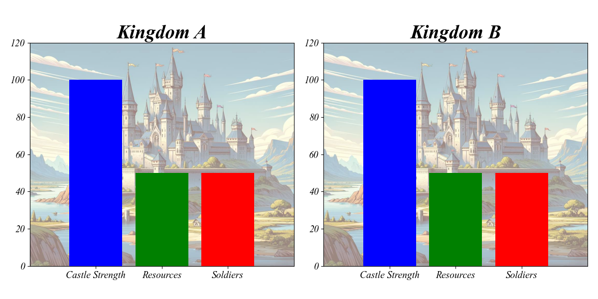

# Kingdom Conquest: A Strategy Game 🏰

## Overview 🌍
Kingdom Conquest is a strategic simulation game where two kingdoms compete for supremacy. Players manage resources, build armies, and fortify their castles to either outlast their opponents or conquer them through strategic attacks. The game combines elements of resource management, strategic planning, and probabilistic outcomes, making every playthrough unique and challenging.

## Gameplay 🎮
- **Kingdoms**: Each player controls a kingdom with three main attributes: Castle Strength, Resources, and Soldiers.
- **Turn-Based**: The game is turn-based, with each kingdom taking one action per turn.
- **Actions**: Players can choose from four actions each turn:
  - **Attack** ⚔️: Attempt to damage the opponent's castle and reduce their soldier count. The success of an attack is probabilistic, depending on the soldiers' strength of both kingdoms.
  - **Gather Resources** 🌾: Increase the kingdom's resources, which are necessary for other actions.
  - **Train Soldiers** 🛡️: Use resources to increase the kingdom's soldier count.
  - **Fortify Castle** 🏰: Strengthen the castle using resources, making it harder for the opponent to cause damage.

## Winning the Game 🏆
The game is won by either:
- Reducing the opponent's castle strength to zero.
- Reducing the opponent's soldier count to zero.

## Stochastic Elements 🎲
The outcome of battles and some actions are stochastic, meaning they have an element of randomness. This adds an unpredictable aspect to the game, requiring players to adapt their strategies.

## Q-Learning AI 🤖
The game can be played against a Q-learning AI, which learns and adapts its strategy based on the outcomes of its actions. This AI provides a dynamic and challenging opponent, learning from each game to improve its tactics.

By receiving different rewards based on the state changes, an RL-agent can learn more about the stochastic game's dynamics. For example, if an attack often fails when the agent has fewer soldiers than the opponent, it might learn to train more soldiers before attacking. 

## Getting Started 🚀
To play the game, simply run the main script and choose your actions each turn. When playing against the AI, observe how it adapts its strategy over time, providing a unique strategic challenge in each game.

For more info see the [documentation](docs/Docs.md).

---------------------------------------------

---------------------------------------------